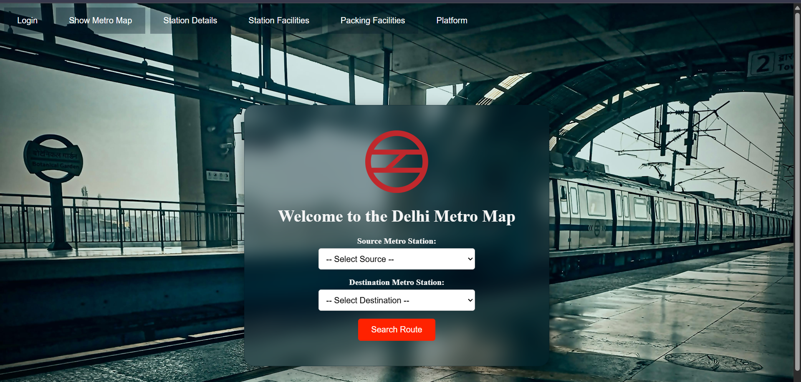
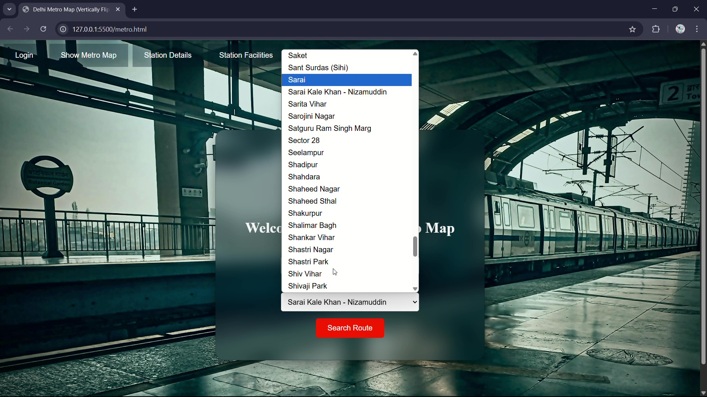
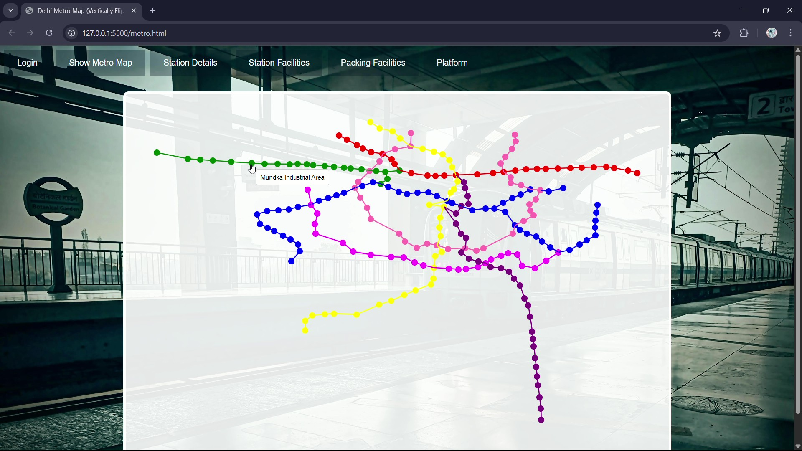
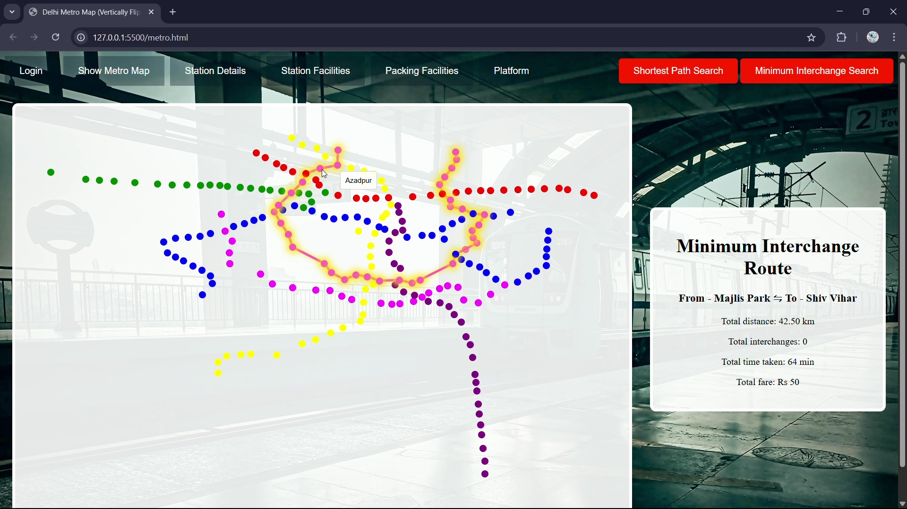

<h1 align="center">🛤️ Delhi Veins</h1>

  <em>A complete metro route visualizer & pathfinder built on the real Delhi Metro network using Dijkstra’s algorithm and custom GUI.</em>

  

---

## Project Highlights

- 🔁 **Shortest Path Finder:** Implements Dijkstra’s algorithm to calculate the minimum number of stations.
- 🔄 **Minimum Line Exchange Path:** Uses Modified Dijkstra's to compute paths with the least metro line changes.
- 🗺️ **Real Map Rendering:** GUI built with **html**,**CSS** and **javascript**, using true station coordinates.
- 🧮 **Fare & Distance Calculator:** Computes approximate travel cost based on station hops.(approximation fare) 
- 📂 **Custom Dataset:** Curated and cleaned Delhi Metro data from scratch using ChatGPT and external geolocation sources.
- 🌐 **Logic - integrated** Terminal version written in **C++** upgraded to a graphical one with full **httplib** integration in the web version.

---

### Problem Statement
Create a real-time metro route pathfinder to visualize Dijkstra's Algorithm. The project simulates Delhi Metro’s functioning with visual clarity and algorithmic accuracy.

### Objectives
- Visualize metro stations and routes accurately
- Find optimal travel paths with respect to:
  - Shortest travel (least stations)
  - Least interchanges (minimum line changes)
- Calculate fare dynamically
- Represent station connectivity and lines with real coordinates and colors

---

## 💻 Tech Stack

| Domain               | Tools / Technologies                            |
|----------------------|--------------------------------------------------|
| Programming Language | C++, JavaScript (web version)                   |
| GUI Framework        | HTML, CSS       |
| Algorithms           | Dijkstra’s Algorithm, BFS                       |
| Backend (Web ver.)   | `httplib` (C++ HTTP Server Client Library)      |
| Data Format          | CSV (for stations & connections)                |

---

## Project Glimpse

### Station Selection

### Metro Map Design

### 🔄 Minimum Exchange Visualization

---
## 🔗 Related LinkedIn Post

> ✨ “What began as a mini-project turned into a metro-sized journey.”  
> Read the full story behind building **Delhi Veins** on LinkedIn:  
**[🔗 Click to read](https://www.linkedin.com/in/diyumana-bhardwaj)**

