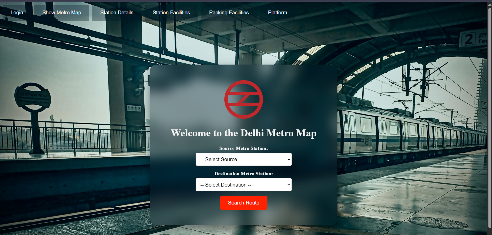
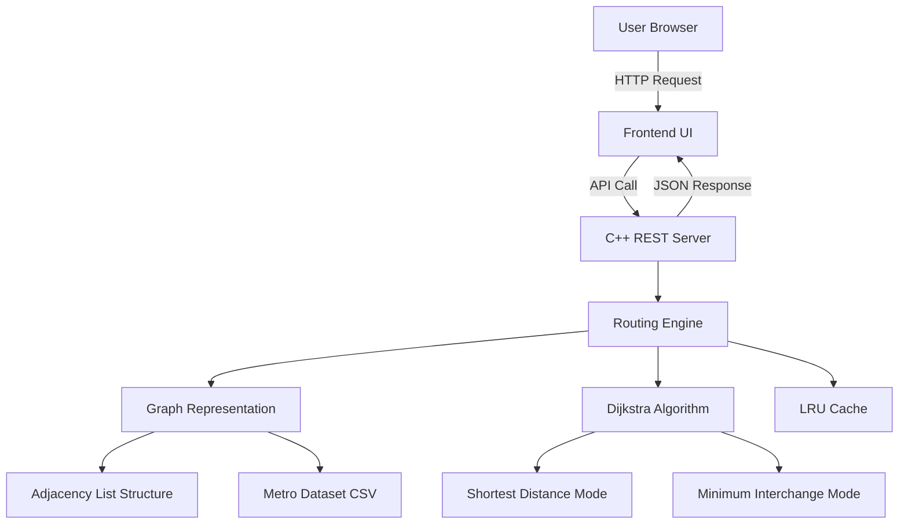
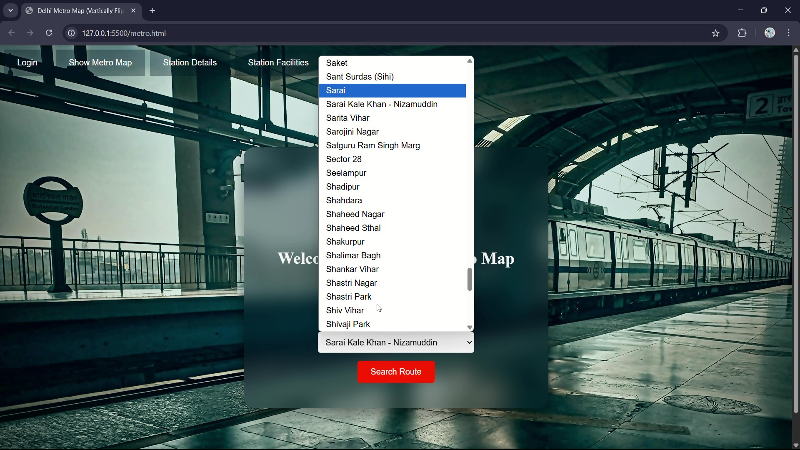
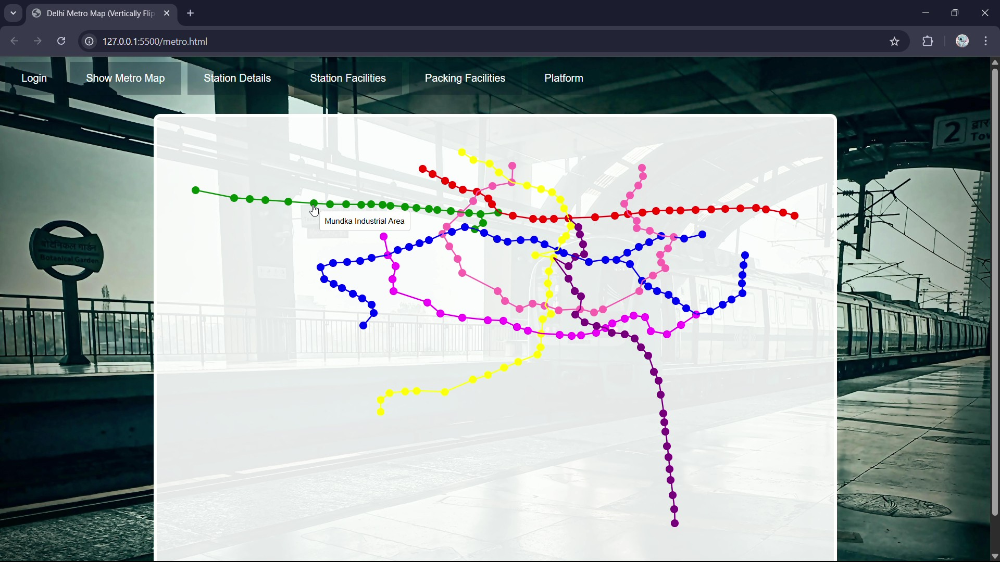
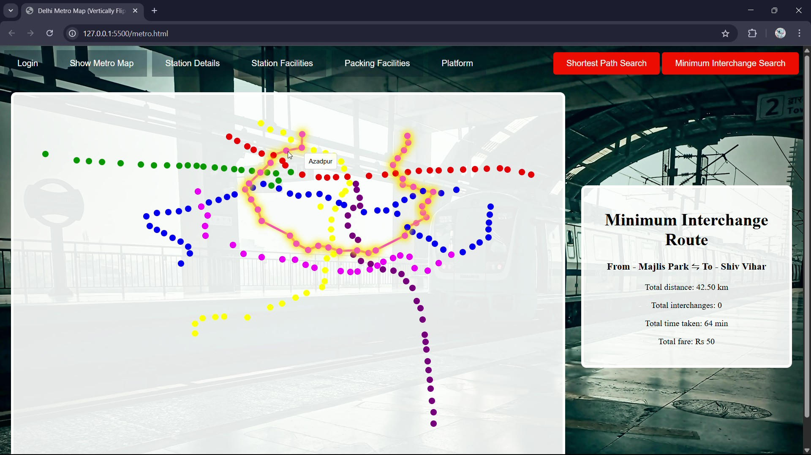

<h1 align="center">🛤️ Delhi Veins - Metro Routing Engine</h1>
<p align="center">


</p>
<p align="center">
  <em>A high-performance metro route planning system built using graph algorithms, optimized data structures, and concurrent backend architecture.

The system models the Delhi Metro network as a weighted graph and exposes routing APIs capable of computing optimal routes in real time.

The project evolved from a basic graph exercise into a performance-aware backend service focusing on memory efficiency, concurrency, and system behavior under load.</em>
</p>

<p align="center">
  
</p>

## 📚 Table of Contents

- Live Demo
- Project Highlights
- System Architecture
- Core Features
- Benchmark Results
- API Endpoints
- Tech Stack
- Deployment
- Running Locally
- Interface Preview
- Key Learnings
---

# 🌐 Live Demo

Frontend

```
https://delhi-veins.onrender.com/
```

API Example

```
/shortest_path?source=Rithala&destination=Rohini%20West
```

---

## 🚀 Project Highlights

* 🔁 **Shortest Path Routing Engine:** Implements **Dijkstra’s algorithm** over a weighted metro graph to compute optimal routes between stations with minimal travel distance.

* 🔄 **Minimum Interchange Optimization:** A modified **multi-objective Dijkstra implementation** that prioritizes routes with the fewest metro line exchanges for improved passenger convenience.

* ⚡ **Performance-Optimized Graph Representation:** Replaced string-based adjacency maps with **integer-indexed graph structures**, eliminating hashing overhead and improving traversal efficiency.

* 🧠 **Concurrency-Safe Routing Backend:** Backend routing service built in **C++** using `cpp-httplib`, supporting concurrent API requests with thread-safe operations.

* 💾 **LRU Query Cache:** Designed a **bounded LRU caching layer** to store frequently requested routes, reducing repeated computation and improving response latency.

* 🌐 **REST API Routing Service:** Exposes routing functionality via HTTP endpoints, enabling real-time metro queries through a lightweight frontend interface.

* 🗺️ **Interactive Metro Map Visualization:** Frontend built with **HTML, CSS, and JavaScript**, rendering metro stations using real coordinate data and dynamically highlighting computed routes.

* 🧮 **Fare & Distance Estimation:** Calculates approximate travel fare and total distance based on route length and station transitions.

* 📂 **Custom Metro Dataset:** Curated and cleaned Delhi Metro station data using geolocation sources and structured CSV datasets for graph construction.

* 🔄 **System Evolution:** The project originated as a **terminal-based C++ metro routing tool** and evolved into a **full web-enabled routing system** with integrated APIs and visualization.
---
> This project focuses on the intersection of **graph algorithms, backend system design, and performance-aware engineering**.
---
## 🧠 System Architecture


```mermaid
flowchart TD

A[User Browser] -->|HTTP Request| B[Frontend UI]
B -->|API Call| C[C++ REST Server]

C --> D[Routing Engine]

D --> E[Graph Representation]
E --> F[Adjacency List Structure]

D --> G[Dijkstra Algorithm]

G --> H[Shortest Distance Mode]
G --> I[Minimum Interchange Mode]

D --> J[LRU Cache]

E --> K[Metro Dataset CSV]

C -->|JSON Response| B
```

---

# ⚙️ Core Features

### Graph-Based Routing

Delhi Metro network modeled as a **weighted graph** using adjacency lists.

### Dual Optimization Modes

1. **Shortest Distance Routing**
2. **Minimum Interchange Routing**

Both implemented using variations of **Dijkstra's Algorithm**.

---

### Performance Optimization

Several architectural improvements were introduced to reduce latency:

**1. Integer Indexed Graph**

Original implementation used string-based adjacency maps.

```
unordered_map<string, vector<Edge>>
```

This introduced hashing overhead.

The optimized version converts stations into **integer IDs**.

```
vector<vector<Edge>>
```

Benefits:

* faster lookups
* improved cache locality
* reduced hashing overhead

---

**2. Multi-Objective Dijkstra**

The routing engine supports:

```
distance optimization
line-change minimization
```

Custom state tracking enables efficient evaluation of both metrics.

---

**3. Thread-Safe LRU Cache**

To avoid recomputation of frequently requested routes:

```
Cache Key = source + destination + query type
```

Cached responses are returned instantly when available.

Benefits:

* eliminates redundant computation
* reduces CPU usage
* improves response time under load

---

**4. Concurrency Safety**

The backend is designed for concurrent requests using:

* mutex protected cache access
* thread-local buffers
* safe shared state management

---

# 📊 Benchmark Results

Performance comparison between baseline and optimized implementation.

| Implementation | Avg Query Time |
| -------------- | -------------- |
| String Graph   | ~4300 µs       |
| Integer Graph  | ~880 µs        |

Optimization improved routing latency by **~75%**.

---

# 🗺 Dataset

The system uses Delhi Metro station and line data stored in CSV files.

```
dataset/
 ├── Delhi_Metro_Lines.csv
 └── metro_coordinates.csv
```

These files describe:

* station connections
* line colors
* distances
* map coordinates

---

# 🌍 API Endpoints
### Base URL
```
https://delhi-veins.onrender.com/
```

### Shortest Distance Route

```
GET /shortest_path
```

Example

```
/shortest_path?source=Rithala&destination=Rohini%20West
```

Response

```json
{
  "path": ["Rithala", "Rohini West"],
  "total_distance": 2.1
}
```

---

### Minimum Interchange Route

```
GET /min_exchanges
```

Example

```
/min_exchanges?source=Rajiv%20Chowk&destination=Huda%20City%20Centre
```

---

# 🖥 Frontend

A lightweight UI built with:

* HTML
* CSS
* Vanilla JavaScript

Features:

* interactive metro map
* station selection dropdown
* animated path highlighting
* route statistics display


---


## 💻 Tech Stack

| Domain               | Tools / Technologies                            |
|----------------------|--------------------------------------------------|
| Programming Language | C++, JavaScript (web version)                   |
| GUI Framework        | HTML, CSS       |
| Algorithms           | Algorithms | Dijkstra’s Algorithm, Graph Traversal                      |
| Backend (Web ver.)   | `httplib` (C++ HTTP Server Client Library)      |
| Data Format          | CSV (for stations & connections)                |

---
# 🐳 Docker Deployment

The project can be containerized for deployment.

Build image

```
docker build -t metro-routing .
```

Run container

```
docker run -p 8080:8080 metro-routing
```
---

# 🚀 Running Locally

Compile backend

```
g++ main.cpp -o metro_backend -std=c++17 -pthread -lws2_32
```

Run server

```
./metro_backend
```

Server starts at

```
http://localhost:8080
```

Open frontend

```
public/index.html
```


## 📷 Application Preview

### Station Selection


### Metro Map Design


### 🔄 Minimum Exchange Visualization


# 🎯 Key Learnings

This project explores several core backend engineering concepts:

* graph modeling
* algorithm optimization
* memory-efficient data structures
* concurrency control
* caching strategies
* API design
* containerized deployment
---
## 🔗 Related LinkedIn Post

> ✨ “What began as a mini-project turned into a metro-sized journey.”  
> Read the full story behind building **Delhi Veins** on LinkedIn:  
**[🔗 Click to read](https://www.linkedin.com/posts/diyumana-bhardwaj_dsa-dsainreallife-learnwithfun-activity-7334260088481730560-hkjp?utm_source=share&utm_medium=member_desktop&rcm=ACoAAESuVMMBVZc_3wpWPqClK3GIK4xugcX6uHU)**

